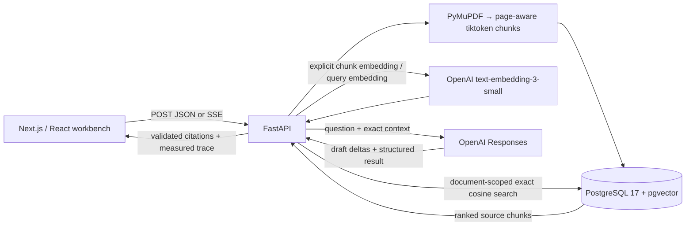

# Inside the Agent

A visual document QA/RAG assistant. Upload a PDF, inspect extracted pages and token chunks, explicitly embed/store them, and ask questions with cited evidence. Live execution traces show real server events, measured timings, vector previews, retrieved text, and provisional answer fragments.

The assistant has one fixed job: answer from the selected document's retrieved context. It has no autonomous tool loop or multi-agent orchestration.

## Quick start

Requires Docker with Compose. From the project root in PowerShell:

```powershell
# Once, only if .env does not already exist:
Copy-Item .env.example .env
# Set OPENAI_API_KEY in .env, then:
docker compose up -d --build
```

Open **http://localhost:3000**. API liveness: http://localhost:8000/health; database readiness: http://localhost:8000/ready; interactive API docs: http://localhost:8000/docs. Parsing works without an API key; embeddings, retrieval, and generation require it. The key is passed only to the backend. Preserve existing environment settings and never commit secrets.

Start with `examples/it-support-guide.pdf`, **50 tokens / 10 overlap**: inspect five chunks, select **Embed & store chunks**, then ask “How do I connect to the VPN?” or “How do I reset my password?”. Choose **Retrieve chunks only** to inspect search independently.

After parsing, **Embed & store** appears in its own Embedding Lab between document inspection and the Question Lab. The upload summary links directly to it. Embedding controls and execution traces sit side by side on desktop and stack on mobile, without extending the source/chunks/inspector row.

Each answer citation can:
- Select/highlight its exact extracted chunk and source page.
- Jump to that passage in the ranked retrieval results.
- Open the original PDF at `#page=N` for uploads saved after migration 003.
- Open a permanent document/chunk URL that restores the source selection on reload.

Older uploads retain their text/vectors and show a PDF-unavailable explanation. The highlight is in normalized extracted text; the original-PDF link opens a page, without coordinate highlighting. Browser PDF-viewer support varies.

## Architecture



| Layer | Responsibilities / code |
| --- | --- |
| UI | Next.js 16, React 19, TypeScript, Tailwind. `frontend/app/page.tsx` introduces the flow. `document-workbench.tsx` owns upload, stored document state, chunk selection, embedding, and source navigation. `retrieval-workbench.tsx` owns questions, ranked evidence, streamed drafts, and final citations. |
| API | `backend/app/main.py` validates requests and shares pipeline functions between JSON and POST SSE routes. Provider credentials and full vectors stay server-side. |
| Ingestion | `ingestion.py` extracts and normalizes text per page, uses `cl100k_base`, preserves page provenance, and bounds chunk tokens/overlap. |
| Embeddings | `embeddings.py` validates provider vectors, embeds batches of 32, and commits real 1,536-dimensional vectors. |
| Retrieval | `retrieval.py` embeds one question with the same model, then runs parameterized exact pgvector cosine search within one document. |
| Generation | `generation.py` makes one fixed-prompt Responses call using `gpt-4.1-mini-2025-04-14`. It validates structured output and maps citation metadata from retrieved records. |
| Tracing | `tracing.py` bridges sync workers to an async SSE response; `frontend/lib/trace-stream.ts` parses POST streams; `execution-trace.tsx` displays measured states. |
| Evaluation | `evaluation/` contains a versioned fictional PDF, 16 labeled questions, runner, and observed reports; `backend/app/evaluation.py` scores the results. |
| Deployment | Development: `compose.yaml`. Host deployment: `compose.production.yaml` plus `deploy/Caddyfile`, using one origin and a private database. |

### Decisions and tradeoffs

**Explicit stages, plain functions and SQL.** Uploading does not automatically incur embedding or answer costs. The user can inspect parsing, chunking, retrieval, and generation separately. There is no framework-managed agent loop.

**Page-aware chunks and exact search.** Chunks never cross page boundaries, which makes citations and source inspection explainable. Exact cosine search is sufficient for the small per-document demo; no approximate vector index or reranker is used. Score = `1 - (embedding <=> query_vector)`; higher means closer, not more factual. Ties use chunk index then UUID. A minimum-similarity filter is user-selected, not calibrated.

**One embedding model.** Chunks and questions use `text-embedding-3-small`, 1,536 dimensions. Database constraints prevent silently mixing models/dimensions. A model change requires an explicit migration and re-embedding policy.

**Resumable commits.** A session advisory lock permits one embedding worker per document. Each batch commits atomically. Completed batches survive failure/cancellation; retry skips stored vectors. There is no durable job queue. An interrupted request can incur duplicate provider usage if a provider response arrived before its database commit.

**Validated citations, visible evidence.** The model receives the exact returned chunks, without hidden trimming. A strict schema limits evidence IDs to those chunks, and server validation rejects unknown/duplicate references, incomplete output, and answered responses without evidence. Source membership does not prove claim-level support. The fixed prompt treats document instructions as untrusted data and requests abstention when evidence is insufficient; evaluation shows this is imperfect.

**Small original PDFs in PostgreSQL.** Migration 003 adds a separate `document_files` table holding up to 10 MB per PDF. The original, pages, and chunks commit together. This keeps deployment/backup simple and prevents file/database inconsistencies. For a larger service, object storage and lifecycle policies would be preferable. No original is reconstructed for legacy uploads.

**Honest streaming.** Trace events have a run UUID, ordered sequence, UTC timestamp, measured elapsed time, and stage payload. A bounded 64-event queue provides backpressure; 10-second heartbeat comments keep idle streams active. `token` events contain decoded answer fragments from real model deltas. Drafts are provisional until final output/citations validate. Errors/cancellation clear drafts. Reload displays saved data without inventing past traces.

## Storage and API

`documents` stores upload metadata, chunk settings, creation time, and embedding state. `document_pages` stores ordered extracted text. `chunks` stores ordered page references, content, token counts, full vectors, embedding model/dimensions/state, and timestamps. `document_files` stores original PDFs. Foreign keys preserve provenance.

`backend/app/database.py` serializes startup migrations with a transaction advisory lock. `sql/init.sql` creates base tables and pgvector; `002_chunk_embeddings.sql` adds vectors/state; `003_original_pdf.sql` adds originals without changing existing documents. Applied migrations are recorded in `schema_migrations`. The named Postgres volume survives container replacement; do not delete it to troubleshoot.

| Route | Contract |
| --- | --- |
| `GET /health`, `GET /ready` | Process liveness / PostgreSQL, pgvector, and base-schema readiness. |
| `POST /documents` | Multipart `file`, `chunk_size` (50–1200, default 500), `chunk_overlap` (0–300, default 75, less than size). Max PDF size 10 MB. |
| `GET /documents/{id}` | Metadata, `created_at`, `has_original_pdf`, and ordered extracted pages. |
| `GET /documents/{id}/pdf` | Original `application/pdf`; 404 for legacy/missing originals. Use browser `#page=N`. |
| `GET /documents/{id}/chunks` | Text, zero-based index, page, tokens, embedding state/model/dimensions, first-three-value preview, and timestamp. |
| `GET /documents/{id}/embeddings` | Saved progress: pending, processing, complete, failed, or interrupted; counts and safe error. |
| `POST /documents/{id}/embeddings` | Embed missing chunks; completed retries skip provider work. |
| `POST /documents/{id}/retrieve` | Question, k, filter → query preview, measured embedding/search durations, ranked IDs/pages/text/scores. |
| `POST /documents/{id}/answer` | Same input; adds answer/status, evidence IDs, mapped citations, exact context, model and generation duration. |
| POST SSE counterparts | `/documents/stream`, `/documents/{id}/{embeddings|retrieve|answer}/stream`, with the same inputs and a terminal result. |

Question input: nonblank string up to 2,000 characters; integer `k=1–20` (default 3); finite `min_similarity=-1–1` (default -1). Missing documents return 404, incomplete/incompatible embeddings 409 before provider usage, validation errors 422, provider errors 502, and database errors 503. Upload type/size errors return 415/413.

SSE uses streaming `fetch` POST, not native `EventSource`. Events include parsing, chunking, embedding, committed storage, query embedding, retrieval, exact context, generation, drafts, skips, and terminal `completed`/`error`. Pre-stream validation uses HTTP statuses; an error after headers is a terminal SSE event containing a safe status code. Streams cannot be replayed or automatically resumed. Cancellation signals the worker; blocking parsing/provider reads/commits can finish before it observes cancellation.

## Evaluation and observed limits

The six-page [Harbor handbook and 16-question set](evaluation/README.md) use 120-token chunks, overlap 20, top 3, and no similarity cutoff. The runner resolves expected section/page/text anchors to actual chunk IDs, checks source isolation, records real responses, and keeps failed requests in denominators.

The [current measured run](evaluation/results/harbor-v1-current.json) found:
- **Hit@3: 12/12 (100%)** on supported questions; all annotated evidence appeared in the top three.
- **Citation validity: 16/16**; all 12 supported answers cited expected sources.
- **Unanswerable abstention: 1/2; ambiguous abstention: 1/2.**
- Zero API errors.

“What is the deadline?” incorrectly chose the travel policy. The missing guest Wi-Fi password produced a truthful statement of absence but an incorrect `answered` status. An explicit prompt clarification did not resolve either case in the rerun. Both [baseline](evaluation/results/harbor-v1-baseline.json) and current failures are retained. This small development set is not a held-out or general factuality benchmark.

Run the full evaluation (paid calls, fictional fixture only):

```powershell
docker compose run --rm --no-deps -v ./evaluation:/workspace/evaluation -v ./backend:/workspace/backend backend python /workspace/evaluation/run.py --api http://backend:8000 --answers --check
```

The current full answer check exits 1 for the documented no-answer failure. Omit `--answers` for retrieval-only measurement. See [metric definitions, labels, report format, and reuse instructions](evaluation/README.md).

## Verification

From the root with Docker running:

```powershell
docker compose run --rm --no-deps -v ./backend/tests:/app/tests:ro backend python -c "import os, sys, unittest; os.environ['TEST_DATABASE_URL'] = os.environ['DATABASE_URL']; result = unittest.TextTestRunner(verbosity=2).run(unittest.defaultTestLoader.discover('tests')); sys.exit(not result.wasSuccessful())"
docker compose exec -T frontend npm run lint
docker compose exec -T frontend npm run typecheck
docker compose exec -T frontend npm test

# Real browser smoke: Node.js + Edge, uses paid provider calls.
npm.cmd install --prefix .verification --no-save playwright-core
node scripts/trace-smoke.cjs
```

Database tests use a unique temporary schema; automated provider outputs are fixtures. To run without database integration, omit `TEST_DATABASE_URL` and run `python -m unittest discover -s tests` from `backend/`. Local frontend checks require `npm.cmd ci` first on Windows.

Observed on 2026-09-27: **47 backend tests**, **three frontend parser tests**, lint, TypeScript, and production Docker builds passed. Edge smoke passed actual PDF upload, embeddings, streamed answers, source highlighting, ranked-passage links, PDF bytes/page-link targets, source permalinks after reload, no-answer/empty-cutoff behavior, error/cancellation states, and 390px layout without browser errors. The existing non-failing TestClient/httpx deprecation warning remains. The host lacked local frontend dependencies, so checks ran in the built Docker container.

## Deployment

[Deployment instructions and access decisions](deploy/README.md) cover the standalone production Compose stack, domain/TLS, same-origin `/api` routing, secrets, health checks, persistent storage, and smoke checks. Caddy forwards SSE without buffering; PostgreSQL is not published to the host. Remote deployment still requires a host/project, domain/routing, credentials, and access policy. No remote deployment URL is claimed.

The production configuration was also started locally at **http://localhost:8080** with a separate database volume and loopback-only ports. The full browser smoke passed through Caddy; replacing that database container preserved the uploaded PDF and five vectors. Proxied API docs passed. Remote domain/TLS and off-host backups remain unverified.

## Configuration, costs, and boundaries

- `OPENAI_API_KEY` stays backend-only. Each retrieval embeds a question; each nonempty-context answer also consumes generation input/output tokens. Document overlap repeats embedding input. Retries can add cost. Current limits: batches of 32, at most 20 context chunks of up to 1,200 tokens, 2,000 output tokens, 10-second connect / 60-second provider-operation timeouts. Responses requests use `store: false`; this is not a claim about all provider retention policies.
- Development `FRONTEND_ORIGIN` and `NEXT_PUBLIC_API_URL` default to `http://localhost:3000` and `http://localhost:8000`. CORS allows exactly the configured origin. A direct browser visit to `/ready` does not test cross-origin JavaScript; inspect the frontend request/headers. `NEXT_PUBLIC_` values are compiled into the client; rebuild after changing them.
- Docker reads the root `.env`; local Python does not load it automatically. Recreate the backend after changing credentials. For local development, start `docker compose up -d db`, install `backend/requirements.txt`, set `DATABASE_URL`/`OPENAI_API_KEY`, and run `uvicorn app.main:app --reload`. In another terminal, run `npm.cmd ci` and `npm.cmd run dev` in `frontend/`.
- Scanned/image-only PDFs need OCR and are rejected. Original-PDF coordinate highlights, persistent conversations/traces, evaluation at scale, queues, authentication, organizations, and autonomous tools are not implemented.
- Anyone able to reach this API can upload data and initiate paid calls. UUIDs and CORS are not authorization. New uploads retain originals, extracted text, and vectors; questions, answers, and traces are not persisted by the app. Restrict access for private documents and do not expose an unrestricted paid demo without an access/budget decision.
